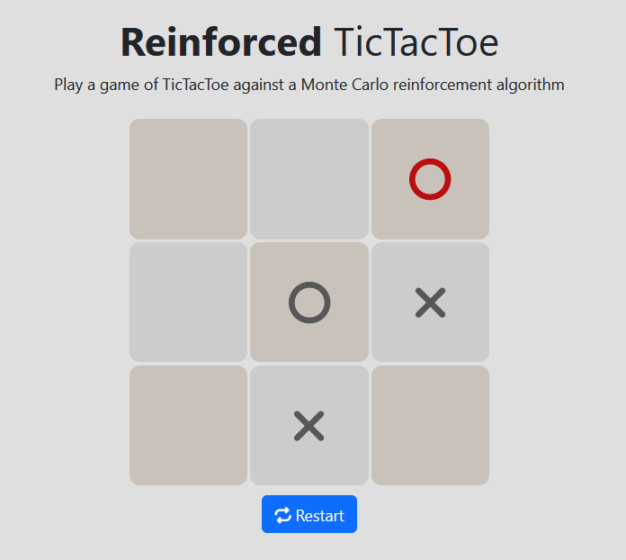
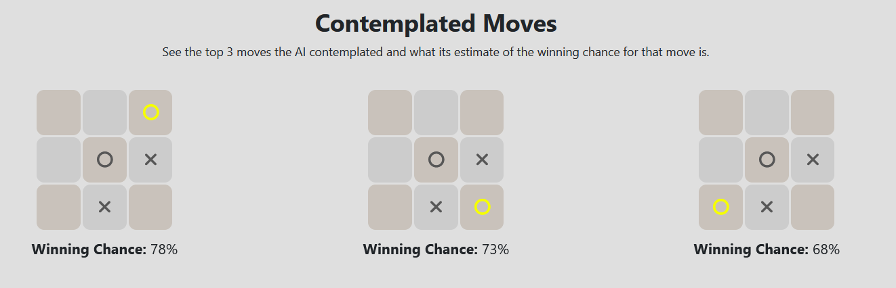

# Reinforced TicTacToe

This project has been created as a demonstration and is completely
open source.

The opponent AI is based on a reinforcement learning algorithm
(On-policy first-visit Monte Carlo) that has been trained on 1 million
matches against a random opponent.

*From Sutton and Barto (2018) _Reinforcement Learning: An Introduction_, chapter 5.4*

The algorithm had no model of TicTacToe and discovered the best
winning strategy play-by-play by discounting a given reward (-1 for a loss / 0 for a draw / 1 for a win) over all previous in-game actions after each episode.

## Training

The calculation (training) of the Q-ActionValues has been done in Python and can be found here: [reinforced_tictactoe.py](./training/reinforced_tictactoe.py). The file contains a class for the TicTacToe game as well as the algorithm used to train the AI. 

## Website

The website has been build with React and Javascript and utilizes the Q-ActionValues generated in training as an opponent AI. The source code for the website can be found here: [/src](./src/).
It consists of the main game board and also shows the user the top three contemplated moves.

